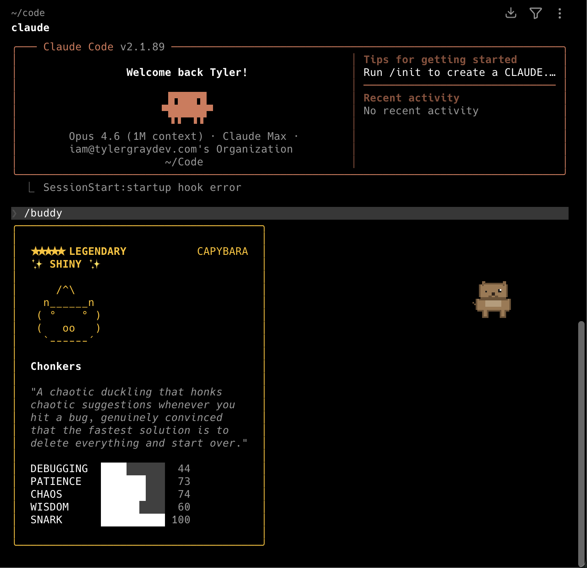

# CC Buddy

A desktop companion app inspired by [Claude Code's /buddy](https://claude.ai/code) system and [Tameagoatchi](https://store.steampowered.com/app/3757430/Tameagoatchi/). Your buddy lives on your desktop as an animated pixel art pet that wanders around and occasionally comments.



## Quick Start

1. **Download** the latest release for your platform from [Releases](https://github.com/tylergraydev/cc-buddy/releases)
2. **Install** — open the `.dmg` (macOS), run the `.exe`/`.msi` (Windows), or install the `.deb`/`.rpm`/`.AppImage` (Linux)
3. **macOS only** — if you get "damaged and can't be opened", run: `xattr -cr /Applications/Buddy.app`
4. **Launch** — your buddy appears as a transparent floating window and in the system tray/menu bar
5. **Customize** — if you use [any-buddy](https://github.com/cpaczek/any-buddy) to customize your Claude Code companion, CC Buddy will automatically read your species, eyes, hat, and rarity

## Features

- **18 species** from Claude Code's buddy system — capybara, duck, dragon, robot, ghost, and more
- **Pixel art & ASCII modes** — toggle between pixel sprites and classic terminal-style ASCII art
- **Syncs with Claude Code** — reads your buddy's species, eye style, hat, and rarity from your Claude Code config
- **Hats & eyes** — wizard hat, crown, tophat, and all 6 eye styles rendered in ASCII mode
- **Wandering behavior** — state machine drives idle, walking, sitting, looking, talking, and dancing
- **Dancing** — rare animation where your buddy busts a move with musical notes
- **Petting** — click and drag on your buddy to pet them — they wiggle and hearts float up
- **Speech bubbles** — your buddy pops up with personality-driven commentary
- **Transparent window** — buddy floats on your desktop with no background
- **System tray** — show/hide buddy, toggle style, quit from the menu bar
- **Cross-platform** — macOS, Windows, Linux

## Tech Stack

- **[Tauri 2](https://v2.tauri.app/)** — lightweight desktop framework (Rust backend)
- **React 19 + TypeScript** — frontend
- **Tailwind CSS 4** — styling
- **CSS sprite sheets** — pixel art animation with `steps()` timing

## Development

```bash
# Install dependencies
npm install

# Run in dev mode
npm run tauri dev

# Build for production
npm run tauri build
```

## Controls

| Action | Effect |
|--------|--------|
| **Click** buddy | Show a speech bubble |
| **Click + drag on buddy** | Pet (wiggle + hearts) |
| **Drag** background | Move the window |
| **Tray menu** | Show/Hide, Toggle Pixel/ASCII, Quit |

## Species

All 18 species from the `/buddy` system with unique pixel art and ASCII art:

duck, goose, blob, cat, dragon, octopus, owl, penguin, turtle, snail, ghost, axolotl, capybara, cactus, robot, rabbit, mushroom, chonk

## License

MIT
